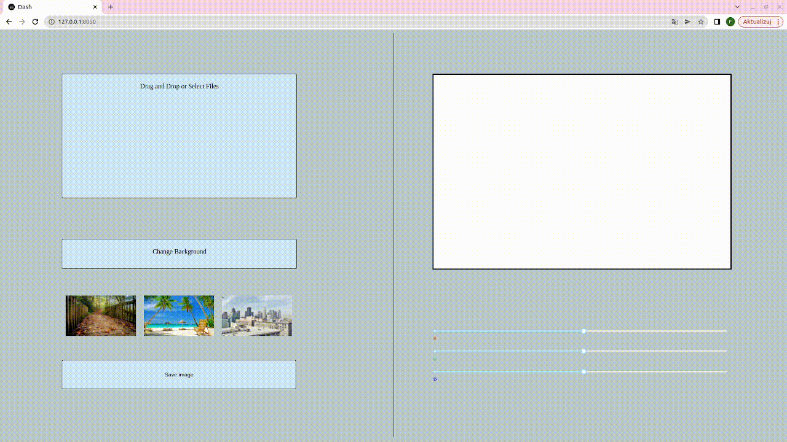

# Why background changer?

This project is mostly for learning dash/flask and mediapipe/opencv.

The segmentation is done with MobileNetV3 model that is implemented in mediapipe.

# Preview




# Run
```bash

git clone https://github.com/filnow/bg-changer.git
cd bg-changer
pip install -r requirements.txt
python3 app.py

```

# TODO

* change model to be slower but more accurate 
* add video support
* make frontend kinda good
* add bilateral filter to mask